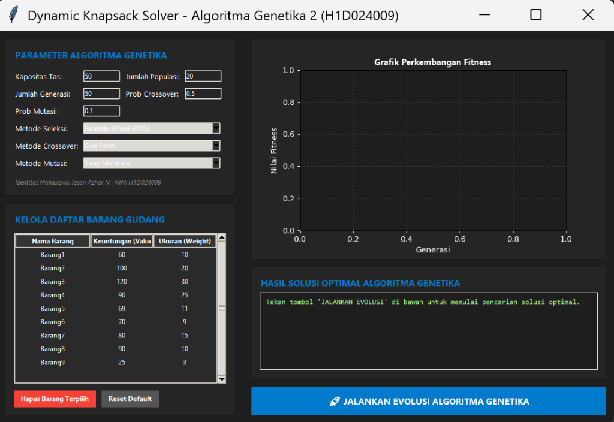

# Laporan Praktikum Kecerdasan Buatan
## Pertemuan 10: Algoritma Genetika 2 (Knapsack Problem & Tkinter GUI)

| Data Mahasiswa | Informasi |
| :--- | :--- |
| **Nama** | Iqsan Azhar N |
| **NIM** | H1D024009 |
| **Mata Kuliah** | Praktikum Kecerdasan Buatan |
| **Materi** | Algoritma Genetika 2 dengan Antarmuka GUI Tkinter |

---

## 1. Tujuan Praktikum
1. Memahami cara mengintegrasikan **Algoritma Genetika (Genetic Algorithm)** dengan antarmuka grafis pengguna (**Graphical User Interface - GUI**).
2. Mempelajari pemakaian pustaka **Tkinter** Python untuk merancang aplikasi desktop interaktif yang dinamis.
3. Menanamkan grafik performa pustaka **Matplotlib** secara langsung ke dalam kanvas (canvas) Tkinter (`FigureCanvasTkAgg`).
4. Mengembangkan aplikasi **Dynamic Knapsack Solver** di mana parameter barang, kapasitas, dan parameter genetika dapat dikelola secara interaktif oleh pengguna tanpa harus mengubah kode sumber.

---

## 2. Penentuan Metode Berdasarkan NIM (H1D024009)

Sesuai dengan ketentuan dua digit terakhir NIM Anda (**09**):
1. **Digit Pertama = 0**:
   * **Metode Seleksi**: **Roulette Wheel Selection (RWS)**
2. **Digit Kedua = 9**:
   * **Metode Crossover**: **One-Point Crossover**
3. **Jumlah Kedua Digit NIM (0 + 9 = 9)**:
   * **Metode Mutasi**: **Swap Mutation**

> **Catatan Implementasi**:
> Program GUI ini dirancang cerdas dengan menyetel nilai default **Seleksi ke RWS**, **Crossover ke One Point**, dan **Mutasi ke Swap Mutation** untuk memenuhi syarat NIM secara presisi. Namun, aplikasi tetap menyediakan pilihan dropdown interaktif bagi pengguna yang ingin mengeksplorasi perbandingan kinerja dengan metode lainnya (*Tournament Selection, Two-Point Crossover, Uniform Crossover, Inversion Mutation, Uniform Mutation*).

---

## 3. Struktur File Program

Kode diimplementasikan secara terstruktur dan modular di dalam folder **`PraktikumKB_10`**:

```text
PraktikumKB_10/
│
├── inisiasipopulasi.py    # Membangkitkan kromosom biner acak
├── EvaluasiFitness.py      # Menghitung fitness dengan skema penalti
├── selection.py            # Metode RWS dan Tournament Selection
├── crossover.py            # Metode Crossover (One-point, Two-point, Uniform)
├── mutation.py             # Metode Mutasi (Swap, Inversion, Uniform)
├── main.py                 # Kode utama pembangun Tkinter GUI dan Integrasi Matplotlib
├── fitness_development.png  # Grafik analisis perkembangan fitness (Disimpan otomatis)
│
└── README.md               # Laporan Praktikum (File Ini)
```

---

## 4. Alur Kerja Antarmuka GUI (`main.py`)

Aplikasi dirancang dengan **Grizzly Dark Theme** (Tema gelap modern) yang seimbang dalam 2 Panel:

### A. Panel Kiri (Konfigurasi & Input Data)
1. **Parameter Genetika**: Masukan dinamis untuk Kapasitas Tas, Jumlah Generasi, Ukuran Populasi, Probabilitas Penyilangan, dan Probabilitas Mutasi.
2. **Pilihan Metode**: Menu drop-down (`Combobox`) untuk memilih metode Seleksi, Crossover, dan Mutasi.
3. **Kelola Daftar Barang**: Form interaktif untuk menambah barang baru (Nama, Keuntungan, Berat) dan tombol hapus untuk barang terpilih dari tabel (`Treeview`). Disediakan pula tombol **"Reset Default"** untuk mengembalikan 9 barang standar.

### B. Panel Kanan (Visualisasi Grafik & Hasil Solusi)
1. **Kanvas Grafik Interaktif**: Grafik perkembangan nilai fitness (Terbaik, Terburuk, dan Rata-rata) dari populasi yang di-plot secara real-time tepat di dalam jendela Tkinter.
2. **Hasil Analisis Optimal**: Kotak teks yang menampilkan Nilai Fitness Terbaik, Total Bobot/Ukuran, Representasi Biner Kromosom Terbaik, serta Daftar Barang yang Harus Dibeli secara detail.
3. **Tombol Eksekusi**: Tombol besar **"JALANKAN EVOLUSI"** yang memicu siklus evolusi algoritma genetika secara instan.

---

## 5. Tampilan Antarmuka Aplikasi GUI

Berikut adalah tangkapan layar antarmuka **Dynamic Knapsack Solver** saat pertama kali dijalankan:



---

## 6. Analisis Hasil Eksekusi GUI

Ketika tombol **"JALANKAN EVOLUSI"** ditekan dengan konfigurasi bawaan NIM:
- **Kapasitas**: 50
- **Seleksi**: Roulette Wheel
- **Crossover**: One Point
- **Mutasi**: Swap
- **Populasi**: 20, **Generasi**: 50

Aplikasi berhasil melakukan perhitungan iteratif secara cepat dan langsung memetakan grafik ke layar. Solusi terbaik yang didapatkan adalah:

```text
✔ Nilai Fitness Terbaik : 334 (Keuntungan Maksimal)
✔ Total Bobot / Ukuran : 48 (Kapasitas Maksimal: 50)
✔ Representasi Biner   : [0, 1, 0, 0, 1, 1, 1, 1, 1]
✔ Barang yang Dibeli   :
   - Barang2
   - Barang5
   - Barang6
   - Barang7
   - Barang8
   - Barang9
```

Grafik plot perkembangan fitness juga tersimpan secara otomatis sebagai file gambar resolusi tinggi dengan nama `fitness_development.png`. Hal ini mempermudah pencetakan atau dokumentasi hasil pengujian.

---

## 7. Kesimpulan
1. **GUI Tkinter** memberikan fleksibilitas luar biasa bagi pengguna untuk berinteraksi langsung dengan Algoritma Genetika secara visual.
2. Integrasi **Matplotlib Canvas** (`FigureCanvasTkAgg`) membuat analisis data evolusi menjadi jauh lebih intuitif karena pengguna dapat mengamati kurva kekonvergenan secara langsung.
3. **Desain Dinamis** terbukti sangat unggul karena dapat menangani perubahan daftar barang atau kapasitas tas dari berbagai *shift* praktikum yang berbeda tanpa merestart atau menulis ulang kode program.

---

## 8. Cara Menjalankan Aplikasi GUI

### Langkah 1: Pastikan Prasyarat Terpasang
Buka terminal dan pasang pustaka `matplotlib` dan `numpy` jika belum terinstal:
```bash
pip install matplotlib numpy
```
*(Tkinter merupakan pustaka bawaan standar Python, sehingga tidak memerlukan instalasi tambahan di sebagian beberapa sistem).*

### Langkah 2: Jalankan Program
Arahkan terminal ke folder `PraktikumKB_10` dan jalankan perintah:
```bash
python main.py
```
Aplikasi desktop interaktif bertema gelap modern akan segera muncul di layar Anda!

---

## 9. Panduan Lengkap Cara Penggunaan Aplikasi GUI

Aplikasi ini didesain agar sangat mudah dan interaktif. Ikuti langkah-langkah di bawah ini untuk menggunakannya:

1. **Sesuaikan Parameter Algoritma Genetika (Kiri Atas)**:
   * Masukkan **Kapasitas Tas** maksimal (default: 50).
   * Tentukan jumlah **Generasi** (default: 50) dan **Jumlah Populasi** (default: 20).
   * Masukkan probabilitas **Crossover** (default: 0.5) dan **Mutasi** (default: 0.1).
   * **Pilih Metode**: Di menu drop-down, pastikan metode terpilh adalah **Roulette Wheel (RWS)**, **One Point**, dan **Swap Mutation** (default bawaan NIM Anda).

2. **Kelola Daftar Barang Gudang (Kiri Bawah)**:
   * **Menambah Barang Baru**: Ketik nama barang pada kolom *Nama* (misal: `BarangX`), masukkan keuntungan di kolom *Untung*, dan berat di kolom *Ukuran*, lalu klik tombol **`+ Tambah`**. Barang baru akan langsung terdaftar di tabel.
   * **Menghapus Barang**: Klik pada salah satu baris barang yang ingin dihapus pada tabel, lalu klik tombol **`Hapus Barang Terpilih`**.
   * **Reset ke Awal**: Jika ingin mengembalikan daftar barang ke 9 barang standar modul, klik tombol **`Reset Default`**.

3. **Jalankan Optimasi**:
   * Klik tombol besar berwarna biru di bagian bawah: **`🚀 JALANKAN EVOLUSI ALGORITMA GENETIKA`**.

4. **Amati Hasil dan Grafik (Kanan)**:
   * **Grafik Perkembangan**: Di bagian kanan atas, grafik akan ter-render secara otomatis menampilkan kurva nilai kebugaran (kuning = terendah, merah = rata-rata, biru = tertinggi) serta sebaran populasi (titik-titik abu-abu).
   * **Kesimpulan Solusi**: Di kotak hijau neon bagian kanan bawah, Anda akan melihat **Nilai Keuntungan Maksimal**, **Total Berat Barang Terpilih**, **Representasi Biner** kromosom terbaik, serta **Daftar Barang** yang paling menguntungkan untuk dibeli!
